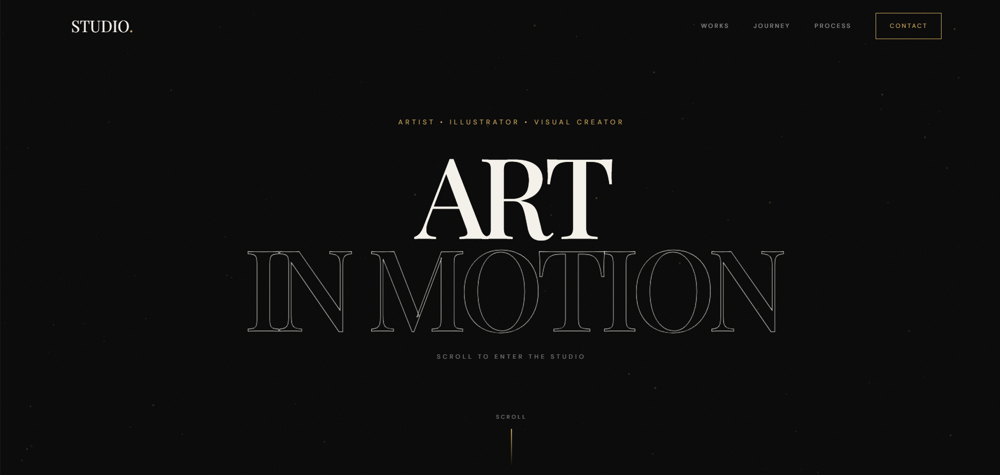
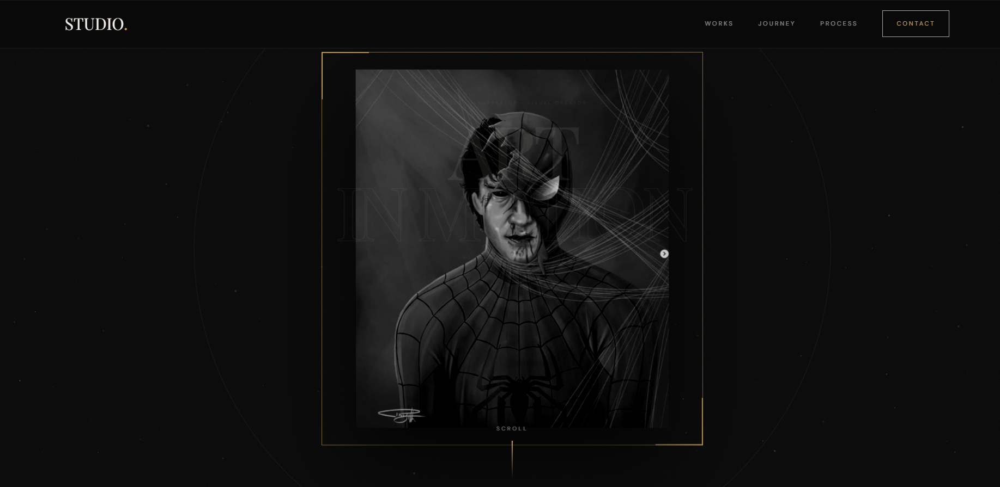
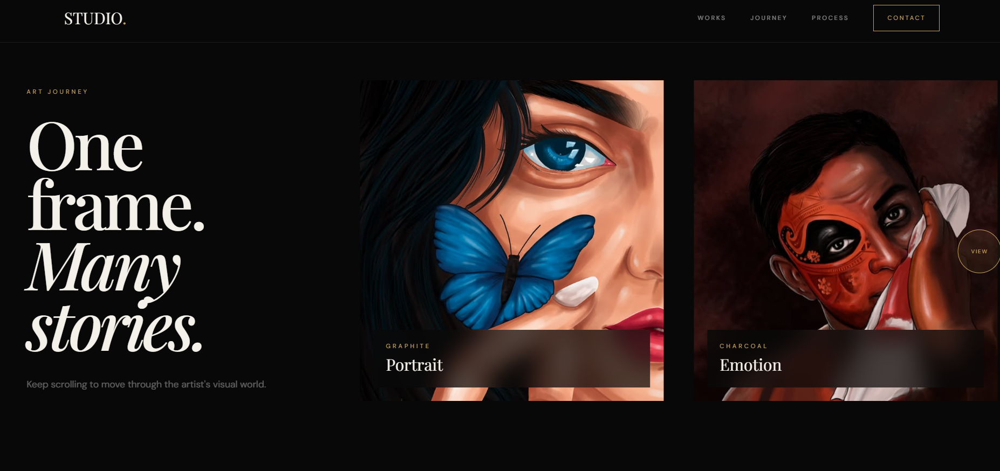
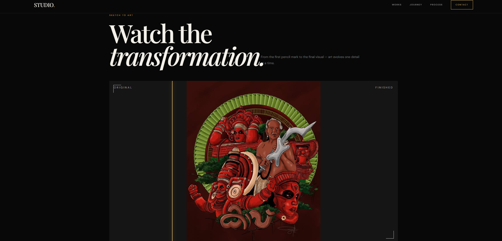
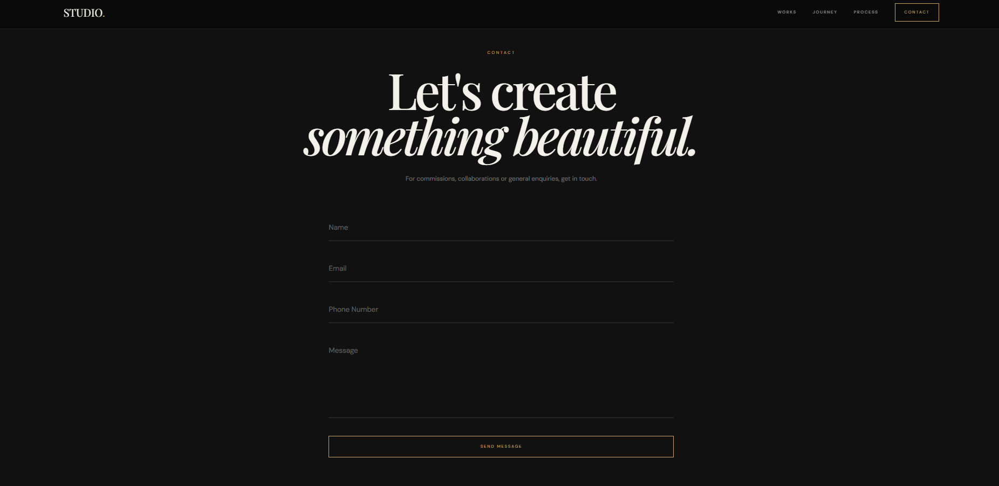

# STUDIO — Artist Portfolio

🔗 **Live Demo:** https://greexhma.github.io/STUDIO/

A modern and interactive artist portfolio website built to showcase artwork, creative projects, artistic processes, and commission services. The website combines elegant visual design with smooth animations and responsive layouts.

---

## 🚀 Features

* Cinematic animated hero section
* Interactive artwork gallery
* Responsive design for desktop, tablet, and mobile
* Smooth GSAP scroll animations
* Custom cursor interaction
* Animated particle background
* Horizontal art journey section
* Sketch-to-art transformation effect
* Artwork commission request form
* Image upload and preview
* Contact form
* Smooth navigation and scrolling

---

## 🛠️ Technologies Used

* HTML
* CSS
* JavaScript
* Tailwind CSS
* GSAP
* GSAP ScrollTrigger
* HTML Canvas
* Google Fonts

---

## 📌 Sections

### 🎨 Hero Section

An animated introduction featuring the artist's artwork, typography, particles, and interactive visual effects.

### 🖼️ Selected Works

A collection of portraits, pencil drawings, digital paintings, and AI visual creations.

### ✨ Art Journey

A horizontal scrolling section showcasing different artworks and artistic styles.

### ✏️ Sketch To Art

An interactive before-and-after transformation showing how an original sketch develops into finished artwork.

### 🔢 The Process

The creative process is divided into three steps:

1. Share Your Idea
2. Choose The Style
3. Create The Art

### 📝 Commission

Users can upload a reference image and submit their requirements for a custom artwork.

### 📩 Contact

A contact form is provided for commissions, collaborations, and general enquiries.

---

## 📷 Screenshots

### 🖥️ Home Page

### 🖼️ Artwork Gallery

### ✏️ Sketch To Art

### 📩 Contact Section

---

## 📂 Project Structure

* index.html
* images/
* screenshots/
* README.md

---

## 💡 Future Improvements

* Add backend functionality for forms
* Add database for commission requests
* Add artwork category filtering
* Add artwork lightbox viewer
* Add CMS for managing artwork
* Add email notifications
* Add more interactive animations

---

## 👩‍💻 Author

**Greeshma K**

Frontend Developer | Creative Web Developer

GitHub: [@greexhma](https://github.com/greexhma)
